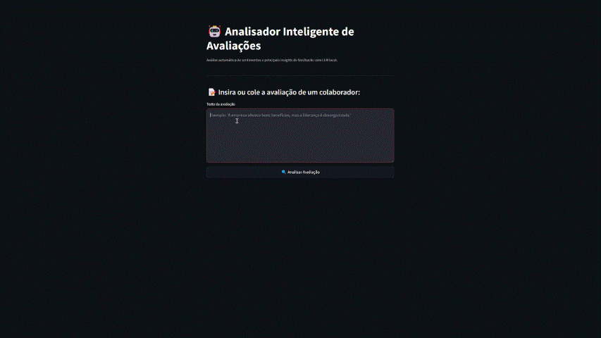

# 🤖 Analisador de Avaliações com LLM Local

**Aplicação completa para análise inteligente de avaliações de colaboradores**, com extração de insights automatizados como **sentimento**, **palavras-chave**, **resumo**, **ponto principal** e **nota de satisfação**.  
O projeto utiliza **LLMs rodando localmente via Ollama**, integrados com **LangChain**, **Pydantic** e uma interface intuitiva com **Streamlit**.

---

## 🚀 Demonstração

 <!-- substitua por sua própria imagem ou gif do app -->

---

## 🧰 Tecnologias Utilizadas

| Categoria             | Ferramentas & Bibliotecas                              |
|----------------------|--------------------------------------------------------|
| **LLM Local**        | [Ollama](https://ollama.com) · Modelos: `gemma3:12b`|
| **Orquestração**     | LangChain · Pydantic (`with_structured_output`)        |
| **Frontend**         | Streamlit                                              |
| **Visualização**     | Matplotlib · WordCloud · Pandas                        |
| **Backend**          | Python                                                 |

---

## 🧱 Funcionalidades

### 🔹 Tela 1: Análise Individual
- Input manual da avaliação
- Botão para gerar uma avaliação fictícia com o LLM
- Saída estruturada com:
  - 🎯 **Sentimento geral**
  - 🔑 **Palavra-chave**
  - 📌 **Ponto principal**
  - 🧾 **Resumo**
  - 📉 **Nota de satisfação (0 a 10)**

## 🧪 Exemplo de Input

```text
Trabalhar nesta empresa foi, infelizmente, uma das experiências mais frustrantes da minha carreira. Desde o primeiro dia, ficou claro que a gestão não tinha qualquer preparo para liderar equipes, sendo constantemente autoritária, sem abertura para diálogo e ignorando completamente as sugestões dos colaboradores. O ambiente de trabalho é altamente tóxico, com uma cultura que premia os mais bajuladores em vez dos mais competentes.
A sobrecarga é absurda — constantemente somos pressionados a cumprir metas irreais sem qualquer suporte ou estrutura. O departamento de RH parece estar de enfeite, pois qualquer reclamação simplesmente é ignorada ou, pior ainda, usada contra o colaborador em futuras avaliações. Não existe plano de carreira, e promoções acontecem apenas por favoritismo.
Além disso, os benefícios são bem abaixo da média de mercado, o salário não é competitivo e os reajustes salariais são raros, mesmo com uma inflação crescente.
A comunicação interna é falha e desorganizada, gerando retrabalho constante. O nível de estresse é altíssimo, e é comum ver pessoas com sintomas de burnout, sem que a empresa faça absolutamente nada a respeito. A alta liderança vive em uma bolha, alheia à realidade dos times operacionais, tomando decisões sem considerar o impacto real nas pessoas.
Em resumo, é um ambiente de trabalho exaustivo, desmotivador e sem perspectiva de crescimento. Minha recomendação sincera para quem valoriza saúde mental, reconhecimento profissional e respeito no ambiente corporativo: procure outra empresa.
```
